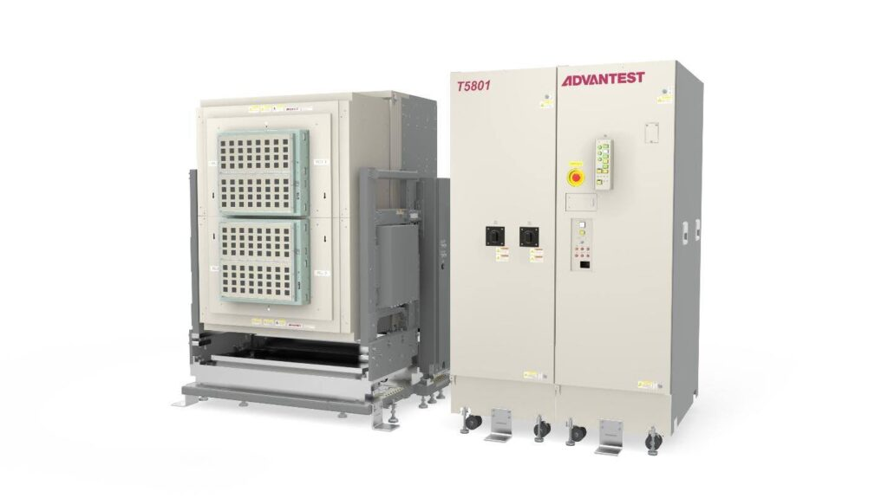

Posted  in [Featured Products](https://www.gosemiandbeyond.com/category/featuredproducts/)

# Advantest Unveils T5801 Ultra-High-Speed Memory Test System to Power Next-Generation DRAM Devices

Early this year, Advantest announced the [T5801 Ultra-High-Speed DRAM Test System](https://www.advantest.com/en/products/semicondoctor-test-system/memory/t5801/). The cutting-edge platform is engineered to support the latest advancements in high-speed memory technologies —including GDDR7, LPDDR6, and DDR6 — critical to meeting the growing demands of artificial intelligence (AI), high-performance computing (HPC), and edge applications. 

Increasingly complex, high-speed memory technologies are pushing the boundaries of data center and AI performance. The T5801 is tailored to address this challenge by enabling accurate and efficient mass production testing for the highest-speed memory devices. Featuring an innovative Front-End Unit (FEU) architecture, the system is uniquely equipped to handle the rigorous requirements of next-generation DRAM modules, delivering industry-leading performance of up to 36Gbps PAM3 and 18Gbps NRZ. 

The T5801 builds on Advantest’s market leadership in DRAM test solutions, including the proven T5503 series and V93000HSM systems. Its support for PAM3, a first in JEDEC-standard DRAMs, highlights the system’s capacity to handle memory innovations such as GDDR7, which is central to achieving ultra-low latency in all AI environments. Its scalable testing infrastructure enables a seamless transition from engineering R&D to production, offering flexible configurations and full compatibility with existing handlers and interfaces. 

  end .post_content

