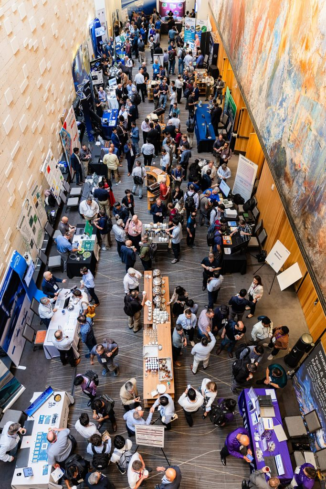

Posted  in [Upcoming Events](https://www.gosemiandbeyond.com/category/upcomingevents/)

# Advantest’s VOICE 2025 Draws Record Attendance in Austin, Texas

Advantest concluded a successful VOICE 2025 at the AT&T Conference Center in Austin, Texas. The event was held on May 12-14 and drew a record-high attendance of over 470 attendees, the majority of whom were Advantest customers and industry partners. 

The VOICE 2025 committee received more than 200 abstract submissions from 39 global companies across 13 countries. Of those abstracts, 89 papers were presented over two days, the majority of which were written or co-authored by Advantest customers. The track listing featured a wide range of topics important to the automatic test equipment (ATE) industry, such as 5G/millimeter wave, high-performance computing (HPC), artificial intelligence (AI), test methodologies, as well as a new track covering automotive, power, analog, and mixed-signal.

This year’s event featured an exciting lineup of three keynote speakers: John Yi, Fellow at AMD; Andrew Yick, senior director of product and test engineering at Marvell Technology; and Roy Meade, executive director for strategic partnerships at the Texas Institute for Electronics. 

In addition to the keynote presentations, attendees had the opportunity to engage with Advantest R&D engineers during the Technology Kiosk Showcase. The event also included “Talk with Experts” lunches, where participants could sit down with experts from Advantest and sponsoring companies to discuss a variety of topics, including silicon photonics, power consumption, thermal control, and silicon validation. Attendees enjoyed valuable networking time during evening events and scheduled breaks. Additionally, a Workshop Day was held on May 15, offering hands-on sessions that focused on advanced RF modulation and demodulation on the V93000 SoC Test System.

The VOICE Partner’s Expo took place throughout the event, enabling Advantest’s partners and sponsors to meet with attendees and exhibit their latest products and offerings. This year’s headline sponsors were Alliance ATE Consulting Group and ISE Labs/ASE Group.

**Best Paper and Best Kiosk Awards**

Attendees voted for the Best Paper and Best Kiosk awards using the VOICE mobile app. This year’s Best Paper awards were presented to Ritesh Mehta from NVIDIA for his paper titled “Predictive Test Selection for Silicon at System Level Using Machine Learning and Cloud Services,” and to Brian Buras, Keith Schaub, Constantinos Xanthopoulos, Yichuan Lu, and Navnath Raut from Advantest for their paper titled “Leveraging Generative AI for Domain-Specific Knowledge Retrieval and Interaction.”

Anik Mehta of Microsoft and Phil Brock of Advantest received an Honorable Mention for their paper, “Left-Shifting Functional Validation to Wafer Sort Test Methodologies.” Additionally, Michael Kozma, Juergen Sang, Alex Perlman, and Benny Wang from Advantest were given an Honorable Mention for their paper titled “Vmin to the Max: A New Approach to Single-Sequencer Run Searching Test Methodologies.” This year’s Best Kiosk award was won by Keith Schaub, Don Ong, and Nadine Schill from Advantest for their “Advantest Talks Semi” kiosk.

**Visionary Award**

This year’s Visionary Award was presented to Kar Leong, senior director of test engineering, Qualcomm. Recipients of the Visionary Award are honored for their significant and sustained contributions to VOICE over time. Leong has contributed papers to VOICE for the past nine years and won the award for Best Paper in 2012.

**VOICE 2026**

Thank you to everyone who joined us for VOICE 2025! VOICE 2026 will be held in Scottsdale, Arizona, at the Fairmount Scottsdale Princess on May 18-20. For more details, please go to: [https://voice.advantest.com/](https://voice.advantest.com/).

  

  end .post_content

