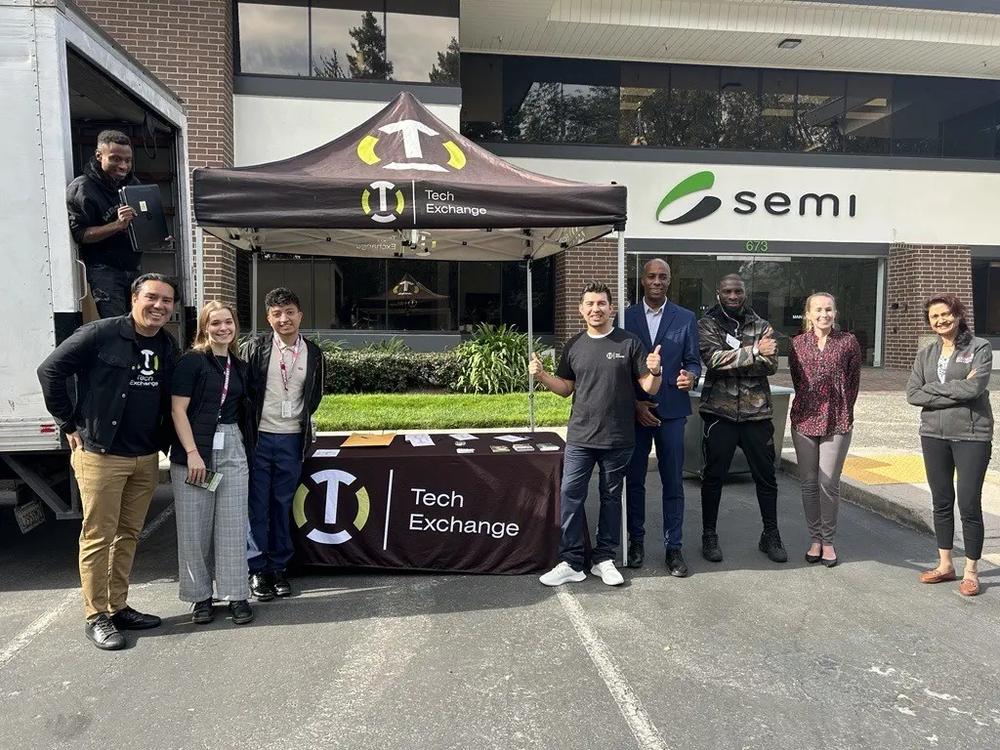
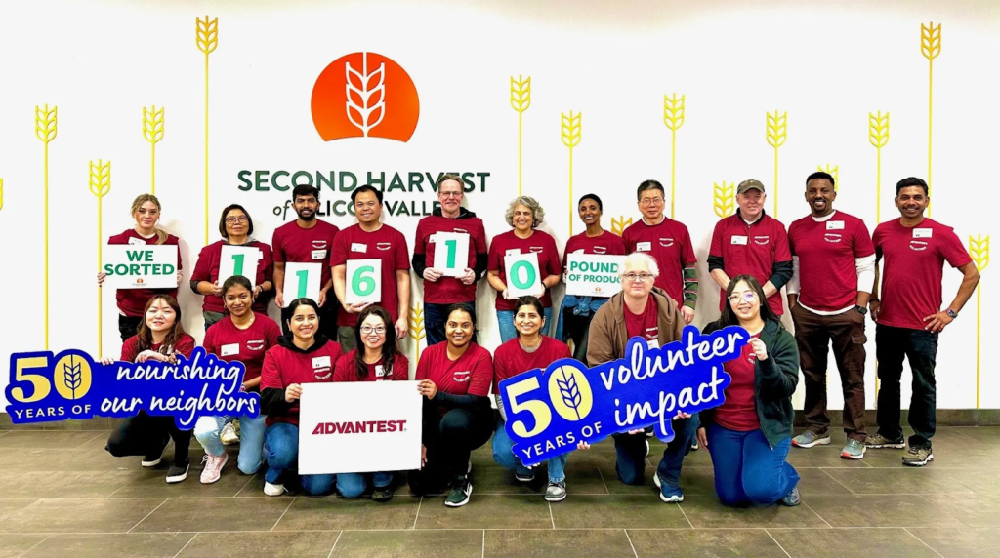
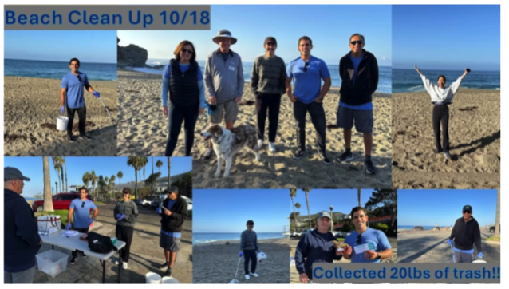
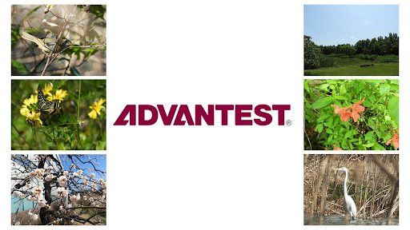

Posted  in [Uncategorized](https://www.gosemiandbeyond.com/category/uncategorized/)

# ESG Spotlight March 2025

  end .et_lb_text_block 

**Advantest Donates Laptops to SEMI & Tech Exchange**

  end .et_lb_text_block 

  end .et_lb_image_content    end .et_lb_module_content_inner 
  end .et_lb_module_content 
  end .et_lb_widget_area 
Last October, the SEMI Sustainability Climate Equity and Social Impact group, in collaboration with Tech Exchange, hosted a used computer equipment drive to collect decommissioned tech equipment, like laptops, keyboards, speakers, monitors, cables, etc., from businesses in the California Bay Area. These items were collected and refurbished for use by students, families, or classrooms, while older or significantly damaged equipment will be deconstructed and used for parts.

Advantest America’s San Jose office provided 121 laptops for the drive, making up nearly a quarter of all donations received that day. The recycling of the electronics Advantest donated will stop 4,909 pounds (or 2,227 kg) of carbon emissions from entering the atmosphere. That is the same as conserving 832 gallons of gasoline, recycling 32,722 aluminum cans, recycling 7,114 water bottles, or saving 189 trees.

  end .et_lb_text_block 
  end .et_lb_column_et_lb_1_3 

**Advantest San Jose Employees Volunteer at Second Harvest of Silicon Valley**

  end .et_lb_text_block 

  end .et_lb_image_content    end .et_lb_module_content_inner 
  end .et_lb_module_content 
  end .et_lb_widget_area 
As part of Advantest's *Employees Making a Difference* initiative, San Jose employees came together on Friday, January 24, 2025, for the quarterly community event, dedicating their time and effort to support Second Harvest in reaching local families in need. This three-hour event provided a unique, hands-on experience for new volunteers, allowing them to contribute to a meaningful cause for the first time.

Advantest volunteers worked together to sort and package 11,610 pounds of nutritious food, reinforcing our commitment to giving back to the community. Through teamwork, our employees played a vital role in ensuring that thousands of individuals facing food insecurity receive essential meals.

  end .et_lb_text_block 
  end .et_lb_column_et_lb_1_3 

**Advantest Test Solutions Volunteers at Second Harvest Food Bank and Pacific Marine Mammal Center**

  end .et_lb_text_block 

  end .et_lb_image_content    end .et_lb_module_content_inner 
  end .et_lb_module_content 
  end .et_lb_widget_area 
Advantest Test Solutions (ATS) concluded its 2024 volunteer season working with the Second Harvest Food Bank and the Pacific Marine Mammal Center. In September, ATS sorted through 3,000 pounds (or 1,360 kg) of peppers that the Second Harvest Food Bank allocated to families in need within Orange County, California. The ATS team also participated in a beach clean-up activity last October at Aliso Beach in the city of Laguna Beach, collecting 20 pounds of trash that would have otherwise been washed into the ocean.

 The team at ATS is dedicated to serving its local community, working to ensure that everyone has access to healthy food and can enjoy clean public spaces.

  end .et_lb_text_block 
  end .et_lb_column_et_lb_1_3 

**Biotope Virtual Tour: Spring in Advantest’s Biotope**

One of the largest biotopes to be created by a company in Japan, the Advantest biotope serves a diverse ecosystem of amazing organisms. We are excited to invite you to explore this special habitat through a 360-degree virtual tour that captures the lush green landscape of springtime in the biotope.

You can access the tour [here](https://www.advantest.com/en/about/sustainability/environment/environmental-communication/biotope/). Start the virtual tour by clicking on the 'Click to Load Panorama' button in the center of the screen.

Once the virtual tour starts, you can use your mouse or the arrow keys on the keyboard to select and change your viewpoint. Move around inside the tour by clicking the arrows on the screen. To move to a different area of the biotope, click the yellow buttons on the map in the bottom right corner of the screen.

  end .et_lb_text_block 

### Recent ESG Recognition

  end .et_lb_text_block 

**Advantest Selected for the Third Consecutive Year for DJSI Asia Pacific**

In December, Advantest announced that it had been selected for the third consecutive year as a constituent stock of the Dow Jones Sustainability Asian Pacific Index (DJSI Asia Pacific), which is operated by S&P Dow Jones Indices in the United States. 

The Dow Jones Sustainability Indices (DJSI) are composed of companies selected for their excellent sustainability performance on both general and industry-specific criteria. Since its launch in 1999, the DJSI has been recognized worldwide as an important indicator of corporate sustainability performance. 161 companies from the Asia Pacific region were selected for DJSI Asia Pacific in 2024, including 78 Japanese companies, one of which is Advantest. 

Advantest's third mid-term management plan sets "Enhance sustainability" as a key strategy. This selection highlights the company's success in implementing this strategy through its Sustainability Policy and our Sustainability Action Plan 2024-2026, which define priority themes, goals and KPIs related to sustainability. Advantest will continue to work towards these goals and ultimately contribute to global sustainability. 

  end .et_lb_text_block 
  end .et_lb_column_et_lb_2_3 

  end .et_lb_image_content    end .et_lb_module_content_inner 
  end .et_lb_module_content 
  end .et_lb_widget_area 
  end .et_lb_column_et_lb_1_3 
  .et_builder 
  end .post_content

