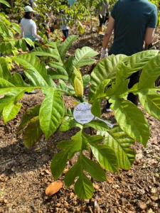
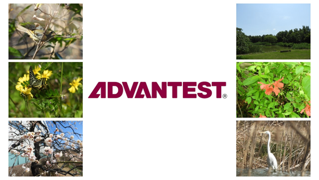

Posted  in [Uncategorized](https://www.gosemiandbeyond.com/category/uncategorized/)

# ESG Spotlight September 2025

  end .et_lb_text_block 

**Growing a Greener Future: Advantest Singapore Tree Planting Initiative**

  end .et_lb_text_block 

  end .et_lb_image_content    end .et_lb_module_content_inner 
  end .et_lb_module_content 
  end .et_lb_widget_area 
On February 21, 2025, 56 volunteers from Advantest Singapore participated in a tree planting event at Windsor Nature Park in collaboration with the National Park of Singapore (NPARKS). Together, the volunteers planted 50 trees, contributing 15,000 SGD to the Garden City Fund and reinforcing the company’s commitment to environmental conservation. This initiative aligns with NPARKS’ “One Million Trees” movement, a nationwide effort to transform Singapore into a City in Nature by 2030 and is also a key part of Advantest’s sustainability initiatives. By planting trees and supporting conservation efforts, Advantest is taking meaningful steps to reduce its environmental footprint and nurture a greener tomorrow.

  end .et_lb_text_block 
  end .et_lb_column_et_lb_1_3 

**Advantest America Employees Continue to Help Fight Hunger During National Volunteer Month**

  end .et_lb_text_block 

  end .et_lb_image_content    end .et_lb_module_content_inner 
  end .et_lb_module_content 
  end .et_lb_widget_area 
In celebration of National Volunteer Month, volunteers from Advantest came together once again to give back to the community by volunteering at Second Harvest of Silicon Valley on **April 25, 2025**. Thanks to everyone's hard work, the volunteers sorted over **28,500 pounds of produce** — enough to provide fresh food to more than **1,140 families** across Silicon Valley. Advantest and its employees remain committed to making a positive impact on the communities we serve. 

  end .et_lb_text_block 
  end .et_lb_column_et_lb_1_3 

**Advantest Test Solutions Supports South County Outreach**

  end .et_lb_text_block 

  end .et_lb_image_content    end .et_lb_module_content_inner 
  end .et_lb_module_content 
  end .et_lb_widget_area 
Last May, 20 volunteers from Advantest Test Solutions (ATS) assisted the food bank of South County Outreach (SCO) in Irvine, California. Together, volunteers sorted through a combined total of 8,200 lbs (roughly 3,720 kilos) of donated fresh produce, canned and packaged goods. These goods eventually made it onto the shelves of the SCO food bank that serves local families and individuals who are unhoused or are currently experiencing financial hardship. Advantest is pleased to team up with SCO and participate in their mission to serve our local community.

  end .et_lb_text_block 
  end .et_lb_column_et_lb_1_3 

### Biotope Virtual Tour: Spring in Advantest’s Biotope

One of the largest biotopes to be created by a company in Japan, the Advantest biotope serves a diverse ecosystem of amazing organisms. We are excited to invite you to explore this special habitat through a 360-degree virtual tour that captures the lush green landscape of springtime in the biotope.

You can access the tour [here](https://www.advantest.com/en/about/sustainability/environment/environmental-communication/biotope/). Start the virtual tour by clicking on the 'Click to Load Panorama' button in the center of the screen.

Once the virtual tour starts, you can use your mouse or the arrow keys on the keyboard to select and change your viewpoint. Move around inside the tour by clicking the arrows on the screen. To move to a different area of the biotope, click the yellow buttons on the map in the bottom right corner of the screen.

  end .et_lb_text_block 

### Recent ESG Recognition

  end .et_lb_text_block 

In March, Advantest Corporation announced that it was recognized under the Large Enterprise Category of the 2025 Certified Health & Productivity Management Outstanding Organizations Recognition Program. This program is jointly managed by the Ministry of Economy, Trade and Industry (METI) and the Nippon Kenko Kaigi (Japan Health Council) to recognize organizations demonstrating excellence in health and productivity management. For the fifth consecutive year, METI also certified Advantest as one of the “White 500,” which recognizes the top 500 corporations under this program. All seven of Advantest’s domestic subsidiaries were certified again this year. 

ince formulating its Declaration of Health and Productivity Management Policy in September 2019, Advantest has worked closely with domestic subsidiaries, health insurance unions and labor unions to encourage employees to schedule routine medical appointments, follow formal health guidance and implement company-wide mental health initiatives. In addition, the company has developed a portfolio of activities to improve the health of employees and their families, including smoking cessation programs, health literacy education and promoting exercise through fitness-tracking applications. 

Advantest is committed to fostering a workplace that supports the physical and mental well-being of every employee and will continue to contribute as a corporate citizen to the development of a sustainable future. 

  end .et_lb_text_block 
  end .et_lb_column_et_lb_2_3 

  end .et_lb_image_content    end .et_lb_module_content_inner 
  end .et_lb_module_content 
  end .et_lb_widget_area 
  end .et_lb_column_et_lb_1_3 
  .et_builder 
  end .post_content

