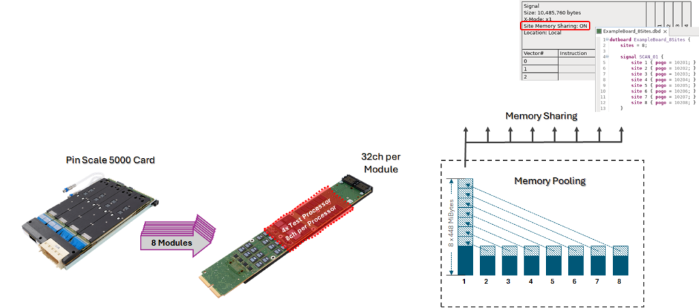
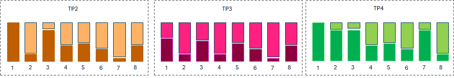
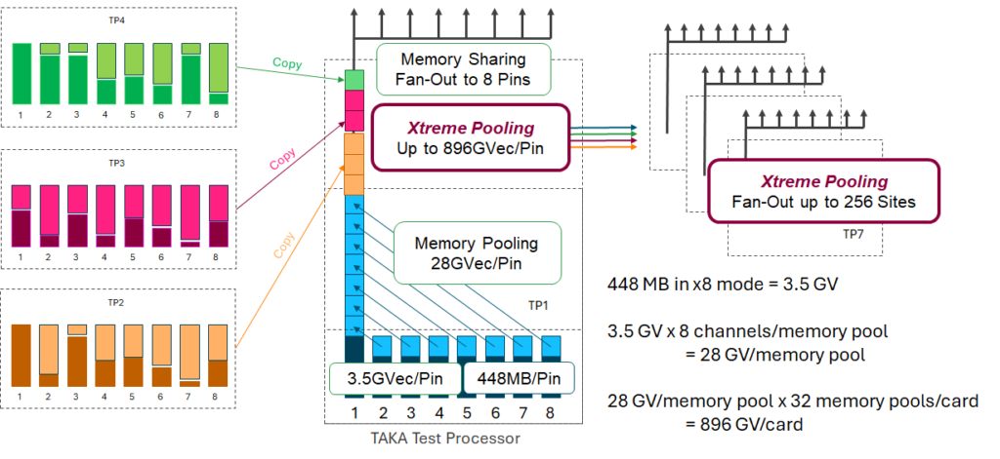
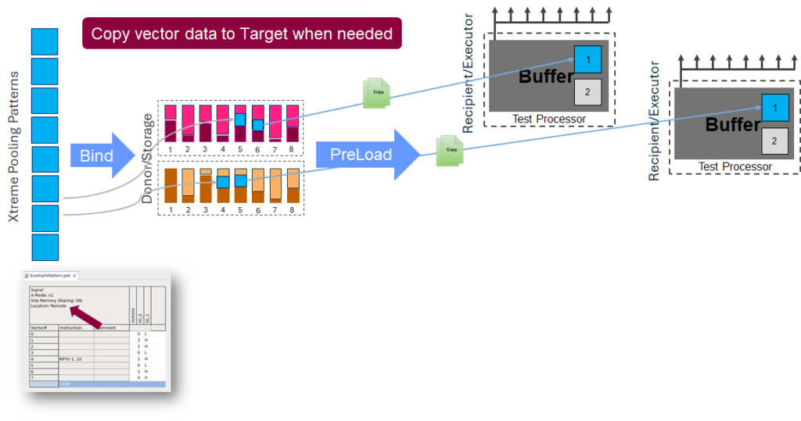
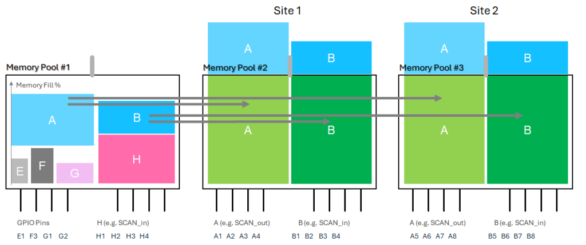

Posted  in [Top Stories](https://www.gosemiandbeyond.com/category/topstories/)

# Optimizing Tester Memory Resources with Xtreme Pooling Technology

*By Ronald Goerke, Senior Application Consultant, Performance Digital Business Group COE, Advantest*

The rapid evolution of semiconductor devices has amplified the demand for advanced automated test equipment (ATE) that can handle increasingly complex test scenarios for logic devices. ATE vector memory is becoming an increasingly valuable commodity as scan-pattern volume soars. Extrapolations based on data from the International Technology Roadmap for Semiconductors (ITRS) indicate that scan data volume will double every three years, and some new data suggests that with the growth of AI products, scan data could begin increasing tenfold over future three-year periods. Furthermore, as parallel and multiplexed scan give way to multi-gigabit high-speed serial I/O (HSIO) scan (as specified in the IEEE 1149.10 standard or in proprietary implementations), devices with fewer pins require even more vector memory behind every single device pin. 

**Contending with the data**

Key drivers of this data explosion include higher gate counts, new and more intricate fault models, and chiplets as they demand lower DPPM. Consequently, ATE systems are increasingly likely to run out of memory when testing complex devices. Several possible solutions can help to more efficiently use available memory: you can use higher levels of pattern compression, avoid pattern duplication, simplify instructions, or combine patterns to avoid complex operating sequences, for example. If such steps are not sufficient, you can use site memory sharing, which must be enabled on a per-pattern basis, or traditional memory pooling, which occurs automatically, although the user must consider load-board design. In either case, sharing is restricted to one memory pool, which can create bottlenecks for data-intensive scan and functional test and can complicate load-board design.

As an example, Advantest’s Pin Scale 5000 digital card contains eight modules, each with 32 channels and four test processors, providing eight channels per test processor. The eight channels represent one memory pool, and traditional memory pooling can stack all eight channels of memory behind one pin, with fanout supporting up to eight channels for multisite memory sharing (Figure 1). However, with the traditional implementation, a given memory pool in the Pin Scale 5000 cannot extend beyond eight channels, potentially leading to a tradeoff between a costly hardware upgrade and compromising test coverage and efficiency. 

*Figure 1. Traditional memory pooling with the Pin Scale 5000 card can stack eight channels behind one pin.*

**Extending the memory pool**

To overcome this limitation and avoid unpleasant tradeoffs, Advantest has introduced the Xtreme Pooling technology with SmarTest release 8.7.2.0, which extends the vector memory pool for the Pin Scale 5000 card beyond eight channels, delivering unmatched flexibility and efficiency and setting a new standard for high-speed, high-data volume test applications. Xtreme Pooling is enabled by Advantest’s proprietary Xtreme Link communication-network technology for ATE systems. 

Xtreme Pooling implementations are possible because a test program usually does not fill the vector-memory pool of all test processors. In Figure 2, moving from left to right, each group of eight vertical bars represents eight channels of memory available for test processors TP2, TP3, and TP4. The dark areas represent memory that the respective test processors utilize, while the lightly shaded areas represent unused memory that could be allocated to other test processors.

 

*Figure 2. Xtreme Pooling makes underutilized memory, indicated by the lightly shaded area of each bar, available to other test processors.*

Several naming conventions help to clarify how Xtreme Pooling works:

- Xtreme Pool refers to all free vector memory.
- Donor refers to a test processor whose memory can store data that can be executed on other test processors.
- Recipient refers to a test processor that can execute vector data copied from other test processors.

In addition, a new pattern property describes two memory locations: *local* (standard, associated with a particular test processor) and *remote* (in the Xtreme Pool).

Xtreme Pooling allows any test processor on a Pin Scale 5000 card to store vector data in other test processors’ underutilized memory. Xtreme Pooling can serve in HSIO applications with data rates up to 4 Gb/s in multisite configurations as well as in any application with high data volumes.

By enabling memory pooling and sharing across all channels and test processors within a single Pin Scale 5000 card, Xtreme Pooling extends the vector-memory pooling limit from 28 giga-vectors (GV) to 896 GV, as shown by the equations at the bottom right of Figure 3. Xtreme Pooling also increases the vector-memory allocation flexibility to 256 sites.

 

*Figure 3. This Xtreme Pooling example expands the memory pool to 896 GV, as shown in the equations on the bottom right, and provides fanout to 256 sites.*

To enable Xtreme Pooling, the user needs to set a flag for those patterns that should be placed in a remote location. While loading the program, the system analyzes the patterns and test program to configure the recipient and donor channels as well as the required buffer sizes. The remote pattern data content is symmetrically distributed to the available donor channels. During test program execution, the remote vector data content required for the execution of a test suite is copied from the donor pools to the recipient buffers (Figure 4). This preload occurs prior to executing a test suite with Xtreme Pooling patterns, and a user can optionally trigger this process early in the test flow as a background operation. After the execution of a test suite, the relevant buffer is freed up for the next preload.

 

*Figure 4. A bind step downloads patterns for donor channels, and a preload step copies content from donors to recipients.*

**Use cases**

Advantest is currently addressing two primary use cases with Xtreme Pooling for high-performance computing and advanced-packaging devices. First, if some scan pins require more memory than is available in a single test processor’s pool, Xtreme Pooling will enable the use of remote memory from low memory pools or additional empty pools, and SmarTest will automatically distribute the vector data to those remote pools. In Figure 5, unused memory in pools 1 and 2 can be allocated to memory pool 3 to provide sufficient vector memory for a single HSIO pin, for example. When a test requests the remote vector data, SmarTest will copy the data to the recipient before execution.

 

*Figure 5. Unused memory from memory pools 1 and 2 can be allocated to memory pool 3.*

The second use case involves multi-site test programs with heavy usage of some signals. As in the first case, SmarTest enables the use of memory from low-memory pools or additional empty pools. Compared to traditional memory sharing among sites, this approach does not require all sites needing access to one signal to be in the same pool to take advantage of vector-data sharing because the same vector data from the donor pool (memory pool 1 in Figure 6) can be copied to multiple memory pools (memory pools 2 and 3 in Figure 6) for zero-overhead fanout to multiple sites (two sites in Figure 6). Note that the use cases illustrated in Figures 5 and 6 are not mutually exclusive; both can be applied simultaneously. 

*Figure 6. The same vector data from donor pool one can be copied to memory pools 2 and 3 for zero-overhead fanout to two sites.*

**Load-board considerations**

Xtreme Pooling also has implications for the load-board layout. 

For applications requiring multiple cards, it is important to distribute high-usage vectors among the cards. To find the optimal solution, first determine which DUT pins require the most vector memory and calculate the number of Pin Scale 5000 cards required for that DUT. Then, distribute the memory-intensive signals evenly between all available cards. Figure 7 shows 40 high-usage scan signals distributed among four cards, with 10 high-usage signals per card.

*Figure 7. High-memory-usage signals are distributed evenly among four cards.*

For success when employing Xtreme Pooling, keep in mind that it works only within one Pin Scale 5000 card; it does not work across multiple cards in one system. In addition, a memory pool can be configured as a donor pool or a recipient pool, but not both, and only vectors can be stored in donor pools, while sequencer programs can be stored only in recipient pools. 

**Summary**

Xtreme Pooling extends vector-memory capacity up to 896 GV per pin by dynamically redistributing unused memory across test processors. The technology enhances memory availability and simplifies load-board design, mitigating the complexities of wiring and signal routing on dense test boards. Moreover, by providing a software-driven solution to overcome memory constraints, Xtreme Pooling supports cost-effective scaling and boosts overall test efficiency with reduced reliance on specialized hardware configurations. Advantest, in collaboration with leading semiconductor companies, has already demonstrated Xtreme Pooling’s value for cutting-edge applications. As data volumes continue to grow exponentially, Xtreme Pooling offers a scalable, cost-effective solution that enhances test versatility, reinforcing Advantest’s position as a leader in the era of increasing device complexity.

  end .post_content

