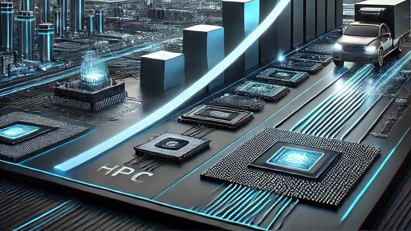

Posted  in [Top Stories](https://www.gosemiandbeyond.com/category/topstories/)

# The Future of Semiconductors: Trends, Challenges, and Opportunities

*This article is adapted with permission from a recent Advantest blog post.*

*By Keith Schaub, Vice President of Technology and Strategy at Advantest*

The semiconductor industry is experiencing a significant transformation driven by technological advancements, market dynamics, and geopolitical factors. In a recent episode of *Advantest Talks Semi*, Andrea Lati, a leading expert in semiconductor market analysis at TechInsights, provided an in-depth discussion on the forces shaping the industry, key challenges, and the future outlook.

**A Market on the Rise**

The semiconductor market has performed far better than expected in 2024, with a projected 23% increase in overall sales and a 28% surge in IC sales—the fastest growth in over a decade, according to Lati. This surge marks a robust recovery from the downturn experienced in 2022 and 2023. The market cycle, says Lati, which typically fluctuates every two to three years, suggests that 2025 and 2026 will continue this upward trend.

However, what makes this growth particularly interesting is that it is primarily driven by increased average selling prices (ASPs) rather than unit volume growth. Two major factors contributing to this trend are the recovery of the memory market—specifically DRAM and NAND—and the explosive impact of NVIDIA’s AI-driven demand.

**The AI Boom and Market Disparities**

AI and high-performance computing (HPC) have become the primary drivers of semiconductor market growth, pushing demand for advanced logic and high-bandwidth memory (HBM). While AI-related semiconductor sales have soared, broader market segments such as PCs, smartphones, and automotive remain in a recovery phase. These sectors still struggle with excess inventory, limiting their growth potential in the near term.

Despite the strong AI-driven upturn, unit volumes for semiconductors are projected to grow by only 2% in 2024, according to Lati. This discrepancy highlights an imbalance in the market, where AI applications drive demand while traditional segments experience slower rebounds.

**Geopolitical and Supply Chain Considerations**

A major factor influencing the semiconductor industry is the evolving global supply chain. Over the past few years, China has significantly increased its capital expenditures in semiconductor manufacturing, with three Chinese companies ranking among the top 10 CapEx spenders for the first time. In 2023, China accounted for 35% of total wafer fabrication equipment (WFE) spending, and this figure is expected to rise to 45% in 2024, according to Lati.

Government funding also plays a significant role, with approximately $200 billion in semiconductor-related government incentives across the U.S., China, Japan, and Europe. However, this influx of investment raises concerns about potential overcapacity, particularly in trailing-edge technologies, which could lead to supply gluts and increased tariff measures in Western markets.

**The Future of Semiconductor Technologies**

Looking ahead to 2025, several key trends and technologies will shape the industry’s evolution:

1. Advanced Packaging and Chiplets: As Moore’s Law slows, semiconductor companies are increasingly turning to advanced packaging solutions such as chiplets and 3D stacking. Chiplet technology enables continued performance improvements at the system level, even as traditional transistor scaling reaches its physical limits.
2. Silicon Photonics: AI and HPC applications require immense bandwidth and energy efficiency, making silicon photonics an attractive solution for reducing power consumption and latency in data centers.
3. Expansion of AI Infrastructure: The capital expenditures of major hyper-scalers are projected to exceed $300 billion in 2025, with most of this spending directed toward AI-driven data center expansion.
4. Automotive Semiconductor Growth: While overall vehicle production remains steady, semiconductor content per vehicle continues to rise due to the proliferation of electric vehicles (EVs) and advanced driver assistance systems (ADAS). By 2029, the automotive IC market is projected to surpass $100 billion.

**AI and the Future of Semiconductor Testing**

As AI continues to transform semiconductor technology, manufacturers require advanced solutions to handle the increasing complexity of AI-driven chips and real-time data processing. Advantest’s ACS RTDI™ (Real-Time Data Infrastructure) is a key innovation addressing these challenges, providing a robust ecosystem for real-time data collection, processing, and simulation.

Key ACS RTDI™ Recent Advancements:

- Seamless Integration: Accelerates machine learning (ML) application development with ACS Gemini™ and other tools in the Advantest ecosystem, reducing time-to-market.
- Cross-Test-Floor Data Streaming: Enables secure, efficient Data Feed-Forward (DFF), allowing data to be streamed seamlessly from one test floor to another.
- Automated ML Model Deployment: Simplifies the deployment of AI/ML applications in OSAT production environments, with RTDI now available at leading OSATs and foundries.
- Data-Driven Decision Making During Test: Supports ultra real-time, real-time, and offline adaptive decisions on the production test floor, optimizing yield, quality, and efficiency.

By bridging the gap between development and production, ACS RTDI™ empowers manufacturers with real-time insights, enabling superior decision-making, predictive analytics, and intelligent test operations. This advancement is crucial as AI and HPC applications drive increased demand for semiconductor testing and validation.

**Challenges and Opportunities**

The semiconductor industry faces several challenges that also present opportunities for innovation:

- Talent Shortages: A significant bottleneck for industry growth is the shortage of skilled engineers and technicians. Companies must invest in talent development to sustain long-term expansion.
- Rising Manufacturing Costs: Advanced semiconductor manufacturing processes demand substantial investments, with leading-edge fabs now costing over $30 billion. Efficient resource allocation and strategic partnerships will be essential for managing costs.
- Geopolitical Tensions: Export restrictions and trade policies, particularly between the U.S. and China, create uncertainties in supply chain planning and investment decisions.

**The Role of ATE and Testing**

The rise of chiplets and AI-driven semiconductors is increasing demand for Automated Test Equipment (ATE). As semiconductor devices become more complex, testing requirements are expanding. The ATE market is expected to grow at a similar rate as wafer fabrication equipment (WFE), reversing the historical trend of ATE losing market share relative to WFE.

**Final Thoughts**

The semiconductor industry is poised for significant growth, with AI serving as a major catalyst. However, traditional market segments like PCs and smartphones, as well as geopolitical factors, will continue to influence the industry’s trajectory. Companies that focus on innovation, strategic investments, and talent development will be best positioned to navigate this dynamic landscape.

The future of semiconductors is bright, and as we move towards a trillion-dollar industry by 2030**, **the opportunities for technological breakthroughs and economic growth are vast. As a key enabler of AI-driven advancements**, **Advantest continues to play a pivotal role in shaping the industry through cutting-edge testing solutions and real-time data intelligence**. **The semiconductor sector remains the foundation of the AI revolution**, **and with innovations like ACS RTDI™, its impact on the future of technology cannot be overstated**.**

  end .post_content

